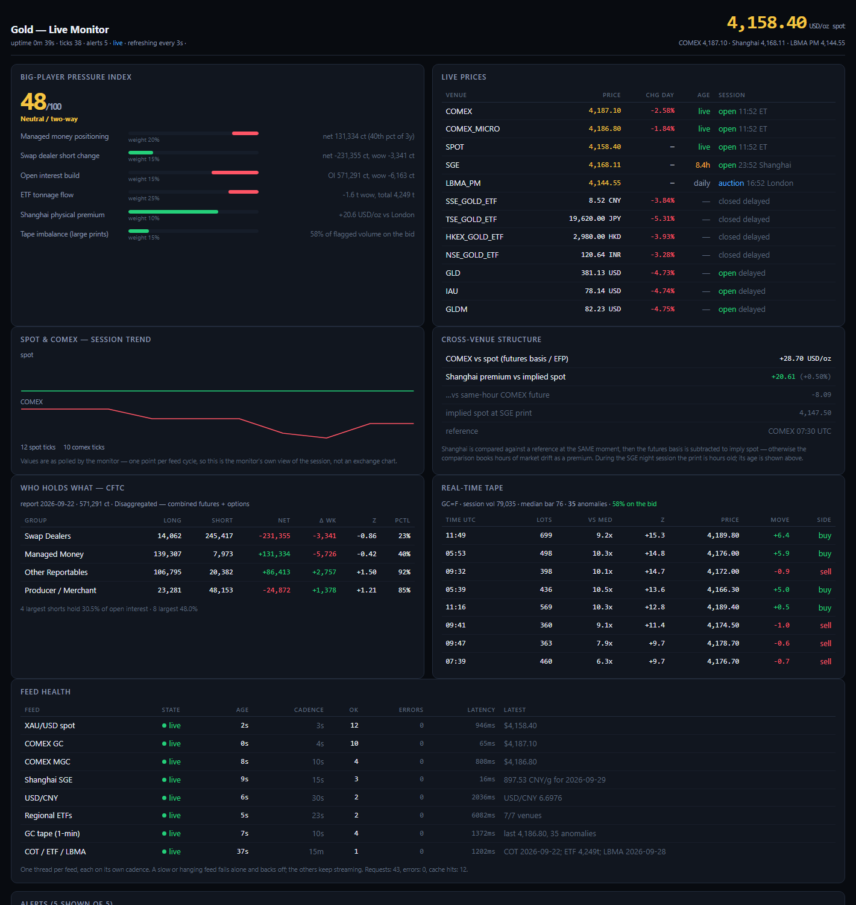
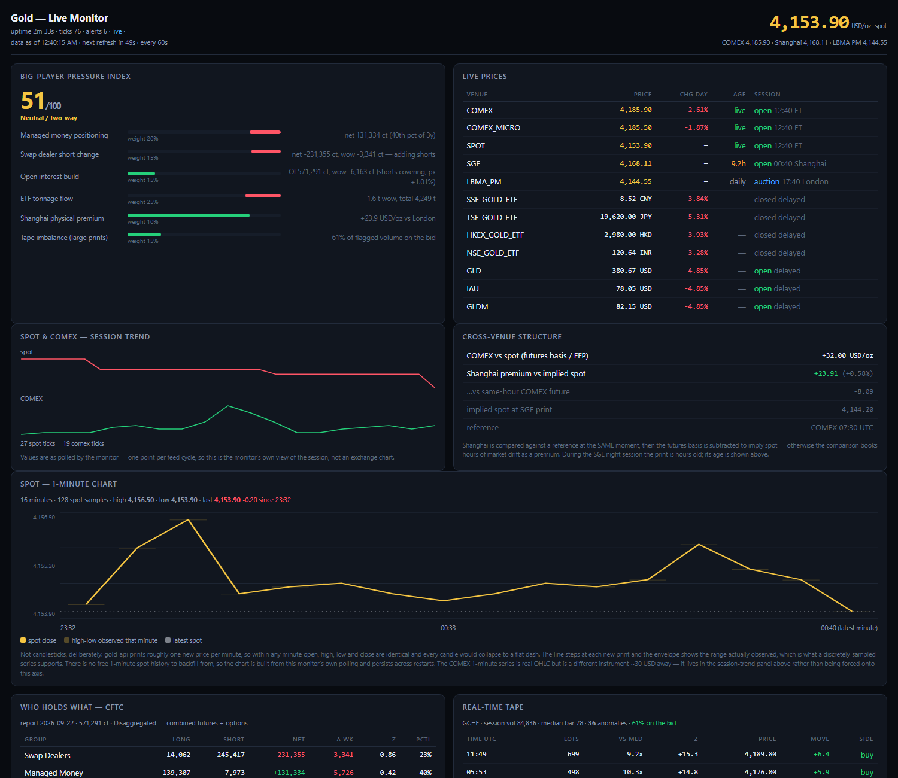
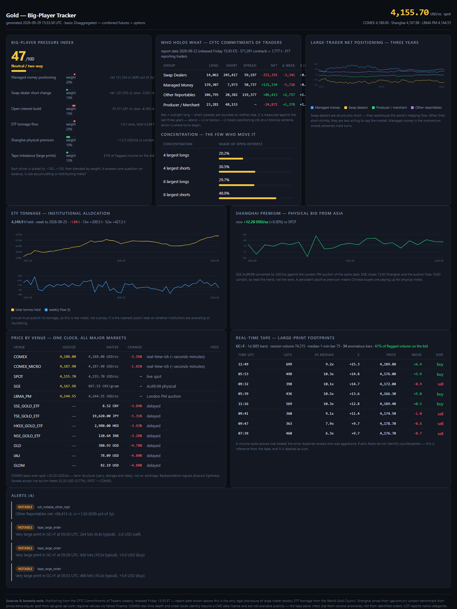

# goldtrack — tracking the big players in gold, across every major exchange

A self-contained Python program that pulls the public evidence of **large-player
behaviour** in gold from every major market and turns it into signals you can act
on: who holds what, who is accumulating, where physical metal is being bid up, and
when size hits the tape.

Runs two ways:

* **live monitor** — concurrent per-feed pollers, a persistent state, and a UI
  that updates in place (terminal or browser)
* **on-demand reports** — one-shot briefs, JSON exports, a static dashboard

Zero third-party dependencies. Python 3.10+. Standard library only — it runs
anywhere Python exists.



```bash
python -m goldtrack monitor      # LIVE terminal monitor
python -m goldtrack serve        # LIVE web monitor at http://127.0.0.1:8787
python -m goldtrack brief        # on-demand full report
python -m goldtrack dashboard    # write a static HTML dashboard
```

### Shareable one-page version

`docs/index.html` is a self-contained JavaScript page that runs on GitHub Pages —
send someone the link and they see it, no install:

**https://jamesyukinsun.github.io/gold-tracker/**

It computes the CFTC positioning table, three-year z-scores and percentiles
**in the browser**, straight from the CFTC's public API. Refresh its baked data
with `python -m goldtrack pages`.

A browser can only read sources that send `Access-Control-Allow-Origin`, which
splits the feeds in half — see [CORS and what a browser can
reach](#cors-and-what-a-browser-can-reach).


---

## Live monitor

`monitor` starts one thread per feed, each on its own cadence, and redraws the
screen in place. `serve` runs the same engine behind a small local HTTP server
and serves a page that polls it every few seconds and flashes numbers as they
change.

```bash
python -m goldtrack monitor                     # terminal TUI
python -m goldtrack monitor --fast 2 --bell     # twice the cadence, beep on alerts
python -m goldtrack monitor --plain --interval 10 > monitor.log   # line mode
python -m goldtrack serve --port 9000 --refresh 2 --open
```

| Flag | Applies to | Meaning |
|---|---|---|
| `--fast N` | both | divide every feed cadence by N |
| `--log FILE` | both | append alerts (and feed ticks) as JSONL |
| `--refresh S` | both | terminal redraw rate / web page poll interval |
| `--duration S`, `--frames N` | monitor | stop after a fixed run (handy for cron) |
| `--plain`, `--interval S` | monitor | line mode + status interval |
| `--bell`, `--no-color` | monitor | audible alerts, plain text |
| `--port`, `--host`, `--open` | serve | bind address and whether to open a browser |
| `--basis futures` | both | use the futures-only COT series |

### Refresh cadence

`--refresh` controls how often the **browser** re-reads the snapshot. It does not
change how often the feeds are polled — the engine keeps collecting at full
cadence either way, so a 60-second page refresh still shows a current value, just
once a minute. The header counts down to the next fetch and shows the timestamp
of the data on screen, so a slow cadence never looks like a frozen page.

Defaults live in `LIVE` in `config.py`:

```python
LIVE = {
    "serve_refresh_s": 60,     # browser re-reads the snapshot every 60s
    "monitor_refresh_s": 1.0,  # local screen redraw — cheap, so fast
}
```

Override per run with `--refresh`, or change the config value to set it
permanently. The terminal monitor's redraw is purely local, so it stays at 1s
regardless of what `serve` does.

```bash
python -m goldtrack serve                      # 60s, from config
python -m goldtrack serve --refresh 5          # watch the tape closely
python -m goldtrack monitor                    # 1s redraw
```

### The 1-minute spot chart

Both front-ends draw a 1-minute chart of spot gold, built from the monitor's own
polling. Two honest constraints shaped it:

**There is no free 1-minute spot history to backfill from.** gold-api.com's
history endpoint requires an API key; Yahoo has no spot symbol (`XAUUSD=X` is
delisted, `GC=F` is the *future*, GLD is an NYSE-hours ETF). So the series is
recorded as the monitor runs — every spot tick is written to the local SQLite
`quotes` table, and the chart is rebuilt from it at startup, so a restart does not
blank it. Ticks older than 24 hours are pruned.

**Candlesticks are the wrong instrument for it.** gold-api prints roughly one new
price per minute, so within any minute open, high, low and close are identical and
every candle would collapse to a flat dash. The chart instead draws:

* the per-minute **high-low envelope** — the range actually observed
* the **close**, as a step line, because the series is a sequence of discrete
  observations rather than a continuous path
* a **latest-price** marker

The COMEX front future is deliberately *not* overlaid. It sits ~30 USD above spot
on a structural basis, so sharing an axis would squash the series you are actually
monitoring into a flat band at the bottom — that mistake was made and fixed. The
COMEX 1-minute series is real OHLC, but it is a different instrument; it lives in
the session-trend panel above, which stacks the two on separate axes.

Line mode (`--plain`) records the same bars but does not draw them, since it is
built for logs.




### Why one thread per feed

Feeds have wildly different natural cadences — spot moves every second, the COT
report changes once a week. Polling them off a shared clock either hammers the
slow feeds or starves the fast ones. Each feed therefore:

* polls on its own interval (spot 5s, COMEX 8s, Shanghai 30s, tape 20s,
  regional ETFs 45s, weekly data 30m)
* fails **alone** — an error backs that feed off exponentially while the rest
  keep streaming
* reports its own health: state, data age, cadence, success/error counts, latency

`--fast` scales all of them at once.

### HTTP endpoints (`serve`)

| Endpoint | Returns |
|---|---|
| `/` | the live page |
| `/api/snapshot` | the complete state as JSON |
| `/api/alerts` | recent alerts only |
| `/health` | one-line plain text; **503** if any feed is degraded, so it drops straight into an uptime monitor |

---

## On-demand commands

| Command | Purpose |
|---|---|
| `brief` | Full one-shot report: index, positioning, flow, venues, premium, tape, alerts |
| `positions` | CFTC large-trader books, concentration, and three-year z-scores |
| `flow` | ETF tonnage and flows by region |
| `venues` | Live cross-venue prices plus basis and Shanghai premium |
| `premium` | Shanghai premium history, spot-matched and COMEX-matched |
| `tape` | Real-time volume anomalies in COMEX gold |
| `alerts` | Only what crossed a threshold |
| `watch` | Simple sequential poll loop (no threads) |
| `dashboard` | Write the standalone HTML dashboard |
| `check` | Prove every feed is reachable (exit code 1 if any fail) |
| `sources` | Describe each feed and its lag |
| `export` | Dump the complete raw snapshot as JSON |
| `db` | Local database statistics and recent alert history |



## How to run it

There is nothing to install — no `pip`, no virtualenv, no dependencies. You only
need Python 3.10 or newer. Tested on CPython 3.10.9 and 3.12.9.

### Easiest — the launcher (Windows)

Double-click `goldtrack.cmd`, or from any terminal, using the folder you cloned
into:

```
C:\path\to\gold-tracker\goldtrack.cmd check
C:\path\to\gold-tracker\goldtrack.cmd monitor
```

With no arguments it prints the help and a list of common commands. The launcher
finds a working Python by itself (newest per-user install → `py -3` → `python`)
and `cd`s to the project folder, so it works from anywhere and does not care
which Python is on your `PATH`.

### From a terminal in the project folder

```
cd path/to/gold-tracker
python -m goldtrack check
```

This is the form to use if you add the folder to your `PATH` or set `PYTHONPATH`.

### From anywhere, without changing directory

```
python path/to/gold-tracker/run.py check
```

`run.py` adds its own folder to the import path, so the module resolves.

### Which Python

`python -m goldtrack` only works from inside the project folder — from elsewhere
you get `No module named goldtrack`. Use the launcher or `run.py` for that case.

On Windows the `python` on your `PATH` may be the Microsoft Store stub, which
opens the Store instead of running anything. If you hit that, name the
interpreter explicitly, or just use `goldtrack.cmd`, which sidesteps the question:

```
"%LOCALAPPDATA%\Programs\Python\Python312\python.exe" -m goldtrack check
```

or just use `goldtrack.cmd`, which sidesteps the question entirely.

### Picking a command

```bash
goldtrack.cmd check          # start here: proves all 9 feeds are reachable
goldtrack.cmd monitor        # live terminal monitor (Ctrl-C to stop)
goldtrack.cmd serve          # live web monitor, then open http://127.0.0.1:8787
goldtrack.cmd brief          # full one-shot report
goldtrack.cmd dashboard      # writes dashboard.html
```

`monitor` and `serve` run until you stop them; the rest exit when done.

A first run downloads the CFTC archives (about 6 MB) and caches them for a day,
so it takes a few seconds longer than later runs.

---

## CORS and what a browser can reach

A JavaScript page running in someone's browser can only read a feed if that feed
sends `Access-Control-Allow-Origin`. This was measured, not assumed:

| Feed | CORS | Result |
|---|---|---|
| CFTC Commitments of Traders (Socrata) | `*` | **live in the browser** |
| Spot XAU/USD (gold-api.com) | `*` | **live in the browser** |
| LBMA benchmark (prices.lbma.org.uk) | `*` | **live in the browser** |
| Yahoo Finance — COMEX GC | none | blocked |
| sge.com.cn — Shanghai | none | blocked |
| fsapi.gold.org — ETF tonnage | none | blocked |

So the shareable page reads positioning, spot and the London benchmark live, and
shows a **timestamped snapshot committed by `python -m goldtrack pages`** for the
three that block it. The page labels which is which, so a photograph is never
mistaken for a feed.

That split is convenient rather than awkward: the CFTC report is the actual
large-player dataset and it is one of the reachable ones, so the most important
data on the page is genuinely live. The blocked set is mostly price-venue data
that the Python monitor covers properly.

---

## What "big players" actually means, and what is knowable

There is no public feed that names the institutions buying gold. Anyone claiming
otherwise is guessing. What *is* public and legally required is far more useful
than most people realise, and this program assembles all of it:

| Lens | Source | What it reveals | Freshness |
|---|---|---|---|
| **Declared positions** | CFTC Commitments of Traders | Every trader above reporting thresholds in COMEX gold, categorised — swap dealers (bullion banks), managed money (hedge funds), producers, other reportables. Plus the **4- and 8-largest-trader concentration ratio**: how few players control the market. | Weekly, Fri 15:30 ET |
| **Institutional allocation** | World Gold Council | ETF tonnage held and weekly flow, by region. A trust must publish its tonnage, so this is real metal. | Weekly |
| **Physical demand** | Shanghai Gold Exchange | SGE Au99.99 premium over London. Persistent premium = Chinese buyers paying up for physical. | Real-time (minute) |
| **Tape footprint** | COMEX GC via Yahoo | Minute-level volume anomalies — the footprint of large orders, with direction inferred from the price response. | ~seconds |
| **Cross-venue prices** | COMEX, London, Shanghai, Tokyo, Hong Kong, Mumbai, New York | All major markets on one clock, normalised to USD/oz where the product allows. | Mixed |

### What this cannot see

Stated plainly so nothing here is mistaken for more than it is:

- **True COMEX depth and order-book identity require a CME data licence.** The
  public feed is aggregated and slightly delayed. The tape panel infers size from
  volume anomalies; it does not identify counterparties.
- **The COT report names categories, never firms** — by law. "Swap dealers" means
  the bullion banks collectively, not a specific bank.
- **London is bilateral OTC.** Only the twice-daily auction benchmark is public.
- **Central-bank buying** is published monthly with a long lag and is deliberately
  opaque; it is not in this tool.

What remains is the complete set of large-player evidence that is publicly and
legally available, on the shortest lag each feed permits.

---

## Install

Nothing to install.

```bash
cd gold-tracker
python -m goldtrack check      # verify all nine feeds are reachable
```

Requires only a network connection. All state lives in `data/`.

---

## Commands

| Command | Purpose |
|---|---|
| `brief` | Full one-shot report: index, positioning, flow, venues, premium, tape, alerts |
| `positions` | CFTC large-trader books, concentration, and three-year z-scores |
| `flow` | ETF tonnage and flows by region |
| `venues` | Live cross-venue prices plus basis and Shanghai premium |
| `premium` | Shanghai premium history vs the London PM auction |
| `tape` | Real-time volume anomalies in COMEX gold |
| `alerts` | Only what crossed a threshold |
| `watch` | Poll continuously, print changes, raise alerts in place |
| `dashboard` | Write the standalone HTML dashboard |
| `check` | Prove every feed is reachable (exit code 1 if any fail) |
| `sources` | Describe each feed and its lag |
| `export` | Dump the complete raw snapshot as JSON |
| `db` | Local database statistics and recent alert history |

Useful flags:

```bash
python -m goldtrack --basis futures positions   # futures-only rather than futures+options
python -m goldtrack --symbol MGC=F tape         # analyse micro gold instead of GC
python -m goldtrack --days 90 premium           # deeper premium history
python -m goldtrack watch --interval 15 --minutes 60
python -m goldtrack positions --json            # machine-readable
```

---

## The signals, and how to read them

### 1. Positioning (CFTC Commitments of Traders)

The heart of the tool. For each category it computes the **net position**
(outright long − short), the week-over-week change, and a **z-score against three
years** of history. Z-scores above ~+2 or below ~−2 mean positioning sits at a
historical extreme — which is where reversals begin, because a crowded book has
no one left to add.

The two that matter most:

- **Swap dealers** are structurally short (in the current report: 245,417 short
  vs 14,062 long, ~43% of open interest). These are the bullion banks warehousing
  the world's hedging flow. When their short shrinks, they are less willing to cap
  the market — a bullish tell.
- **Managed money** is the momentum crowd. Their net long is the speculative
  excess. High percentile = crowded long = vulnerable to long liquidation.

Report basis matters and is never blended: **futures only** (~412k contracts OI)
and **combined futures + options** (~571k) are materially different series. Every
row records which one it came from. `combined` is the default because it also
carries the concentration data.

### 2. Concentration

The 4-largest shorts currently hold ~30% of open interest; the 8-largest, ~48%.
That ratio *is* the measure of how few players move this market. It is reported
directly by the CFTC and parsed from the annual archives.

### 3. ETF tonnage

Total holdings and weekly flow by region. The cleanest public read on whether
institutions are allocating or liquidating, because it is real metal in a vault.

### 4. Shanghai premium

SGE Au99.99 converted to USD/oz and compared against London. Positive means
Chinese buyers are paying over the London price for physical metal.

**Timing caveat, stated in the output:** SGE closes 15:30 Shanghai and the LBMA
PM auction fixes 15:00 London. Same date, different hour. Read the trend, not the
level.

### 5. The tape

Per-minute volume z-scores against a rolling median/MAD baseline, so ordinary
noise stays quiet and genuine size stands out. Direction is inferred from the
price response: a large print that lifts the price was aggressive buying.

### 6. Big-player pressure index (0–100)

A weighted blend of the above — 50 is neutral, above 65 accumulation, below 35
distribution. Each driver is scaled to −100…+100 and reported with its reading so
you can disagree with the weighting and see exactly why it says what it says.

---

## Architecture

```
goldtrack/
  config.py            venue registry, COT column map, thresholds, cache TTLs
  http.py              stdlib fetch: retry, gzip, thread-safe per-host throttle + cache
  models.py            normalised records (Quote, Bar, PositionRow, FlowRow)
  sessions.py          venue trading windows, DST rules, open/closed right now
  sources/
    spot.py            live XAU/USD
    yahoo.py           cross-venue quotes + OHLCV bars + FX
    sge.py             Shanghai Gold Exchange (native API)
    lbma.py            London benchmark auctions
    cftc.py            Commitments of Traders + concentration
    wgc.py             ETF holdings and flows
  engine.py            LIVE: one thread per feed, shared state, derived signals
  monitor.py           LIVE: terminal UI (TUI or line mode)
  webmon.py            LIVE: local HTTP server + auto-updating page
  analytics.py         z-scores, percentiles, premium, tape, composite index
  alerts.py            threshold rules
  snapshot.py          assembles a one-shot snapshot, degrades per feed
  report.py            plain-text rendering
  dashboard.py         self-contained static HTML dashboard
  store.py             SQLite persistence
  cli.py               command line
```

Design decisions worth knowing:

- **Feeds degrade independently.** One dead upstream records an error and the
  rest of the report still renders. In the live monitor, a failing feed backs
  off exponentially on its own thread and shows as `retrying`/`down` in the
  health panel. `errors` appears in JSON output and on the dashboard.
- **Everything is cached to disk** with per-feed TTLs, so repeated dashboard
  refreshes do not hammer public endpoints (and the program still works from
  cache if a feed is briefly down). Live feeds explicitly pass `ttl=0` to
  bypass the cache, because for a monitor a cached price is a wrong price.
- **Persistence is a change log, not a dump.** Alerts are de-duplicated within a
  12-hour window so a rule re-evaluating an unchanged market does not repeat
  itself every run.
- **Alerts from the live engine have a warmup.** Feed-down and
  premium-unverified alerts are suppressed for the first 30s, because they would
  otherwise describe our own startup rather than the market.
- **Data age is tracked, not just fetch age.** Every venue carries the timestamp
  of the underlying print, so a feed that is up-to-date but publishing stale
  data is shown as stale rather than live.

---

## A methodology note you should read

The "Shanghai premium" is the classic read on Chinese physical demand, and the
obvious way to compute it is wrong.

SGE closes at 15:30 Shanghai (**07:30 UTC**). The London PM auction fixes at
15:00 London (**14:00 UTC** in summer). Comparing them — same date, different
hour — books six and a half hours of market movement as a "premium". On
2026-09-29 that calculation returns **+23 USD/oz**. The clock-matched answer is
negative.

Second trap: COMEX gold is a *future*. It carries a basis over spot (roughly
+30 USD/oz of carry), so comparing Shanghai physical against COMEX understates
the premium by the entire basis.

`goldtrack` therefore computes both, and they reconcile:

| Reference | Premium | Why |
|---|---|---|
| COMEX, same hour | −20.27 USD/oz | Same moment, but includes the futures basis |
| LBMA AM, same date | +22.09 USD/oz | Spot benchmark (the convention), ~2h late |

The difference between those two means, +42.36 USD/oz, **is** the futures basis.
Two independent measurements that decompose into a known quantity is the check
that the matching is right.

In the live monitor the same logic runs continuously: the SGE print is matched
to the COMEX price at its own timestamp, and the *live* basis is subtracted to
imply spot at that moment.

The same care applies elsewhere: the monitor shows each venue's **data age**
alongside its price, and when Shanghai's print is hours old — the SGE endpoint
publishes completed sessions — it is labelled stale rather than presented as
live.


---

## Extending it

**Add a venue** — append an entry to `VENUES` in `config.py` with its Yahoo
symbol; it appears in the venue table automatically.

**Add a licensed feed** — if you have a CME Globex licence, write a module in
`sources/` returning `Quote`/`Bar` objects and swap it in `analytics.bullion_usd_oz`.
The rest of the pipeline is source-agnostic; the "what this cannot see" note in
`report.render_sources` is the only place that needs updating.

**Retune alerts** — every threshold lives in `THRESHOLDS` in `config.py`, in one
place, commented.

---

## Caveats

This is an information tool, not investment advice. Public positioning data is
released with a lag: the COT report is as of Tuesday and published Friday, so it
describes a market that is already three days old. It is most useful at extremes
and least useful as a timing signal. Treat the composite index as a summary of
evidence, never as a prediction.
